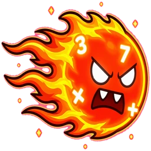
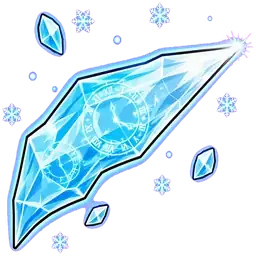
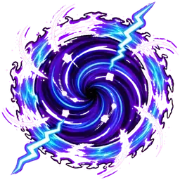

ตรวจสอบโค้ดแล้ว พบประเด็นที่ควรปรับปรุง:

## ปัญหาที่พบ

1. **การคำนวณความเร็วผิด**: `vx` และ `vy` เป็นค่า normalized (-1 ถึง 1) แต่โค้ดคูณกับ `PLAYER_SPEED` อีกรอบ ทำให้ threshold การตรวจจับ "หยุดยืน" ไม่แม่นยำ
2. **ไม่มีระบบกันคนยืนแช่**: ผู้เล่นสามารถยืนนิ่งที่มุมสนามแล้วรอป้ายมาหาได้
3. **ป้ายอาจซ้อนกัน**: แม้ 8 slots จะกระจายดีแล้ว แต่ไม่มี logic ตรวจสอบ

## การปรับปรุง

```js
// ===== BOSS BATTLE SYSTEM =====
// Screen: boss battle - ผู้เล่นเดินหลบท่าโจมตี และยืนบนป้ายคำตอบ

(function() {
  'use strict';

  // ===== CONFIG =====
  const CONFIG = {
    // Movement
    PLAYER_SPEED: 24, // % of arena width per second
    ARENA_BOUNDS: { minX: 2, maxX: 94, minY: 2, maxY: 94 }, // % of viewport
    
    // Collision
    PLAYER_RADIUS: 2.2, // vw
    PAD_RADIUS: 4.5, // vw (ป้ายคำตอบ)
    PAD_ANSWER_CORE: 2.2, // vw — แกนกลางป้ายที่นับว่า "ตั้งใจยืนตอบ"
    PAD_MIN_DISTANCE: 18, // vw — ระยะห่างขั้นต่ำระหว่างป้าย (ป้องกันบังกัน)
    ATTACK_RADIUS: 2.5, // vw
    
    // Timing
    FIRST_ATTACK_DELAY: 6000, // ms
    QUESTION_TIME: 30, // วินาที
    ANSWER_HOLD_TIME: 800, // ms ที่ต้องยืนบนป้าย
    MOVING_THRESHOLD: 0.15, // normalized speed — ต่ำกว่านี้นับว่า "หยุดยืน"
    CAMPING_TIME: 4500, // ms — ยืนแช่นานเกินนี้ถือว่า camping
    CAMPING_ATTACK_DELAY: 1200, // ms — บอสจะยิงโจมตีใส่ camper หลังจากเตือน
    ATTACK_INTERVAL_MIN: 5000, // ms
    ATTACK_INTERVAL_MAX: 8000,
    
    // Damage
    BOSS_HP: 10,
    ATTACK_DAMAGE: 1,
    CORRECT_XP: 15,
    DODGE_XP: 5,
    WIN_XP: 200,
    LOSE_XP: 30,
    
    // Answer pads slots — 8 ตำแหน่งกระจายรอบสนาม
    PAD_SLOTS: [
      { x: 15, y: 40 }, // ซ้ายบน
      { x: 40, y: 30 }, // กลางบน
      { x: 70, y: 30 }, // ขวาบน
      { x: 85, y: 45 }, // ขวากลาง
      { x: 15, y: 70 }, // ซ้ายล่าง
      { x: 40, y: 80 }, // กลางล่าง
      { x: 70, y: 80 }, // ขวาล่าง
      { x: 85, y: 65 }  // ขวากลางล่าง
    ],
    PADS: []
  };

  const BOSS_DATA = {
    mathos: {
      name: 'Mathos the Calculator',
      image: 'assets/boss_mathos.webp',
      badgeId: 'boss-mathos',
      x: 12, y: 15
    },
    chronos: {
      name: 'Chronos the Timekeeper',
      image: 'assets/boss_chronos.webp',
      badgeId: 'boss-chronos',
      x: 12, y: 15
    }
  };

  const ATTACK_TYPES = ['fireball', 'ice', 'portal'];

  // ===== STATE =====
  let gameState = {
    boss: null,
    bossHp: CONFIG.BOSS_HP,
    questions: [],
    currentQIdx: 0,
    timer: CONFIG.QUESTION_TIME,
    combo: 0,
    
    player: { x: 40, y: 80, vx: 0, vy: 0, facingLeft: false, frozen: false },
    
    attacks: [],
    
    padHoldStart: null,
    padHoldIdx: null,
    padPositions: [],
    
    // Anti-camping system
    campingDetection: {
      lastPos: { x: 40, y: 80 },
      stillStartTime: null,
      warned: false,
      attackScheduled: false
    },
    
    phase: 'question',
    
    keys: {},
    joystick: { active: false, startX: 0, startY: 0, deltaX: 0, deltaY: 0 }
  };

  let rafId = null;
  let attackTimer = null;
  let campingAttackTimer = null;
  let timerInterval = null;
  let lastFrameTime = 0;
  let firstAttack = true;

  // ===== DOM ELEMENTS =====
  let container = null;
  let bossSprite = null;
  let playerSprite = null;
  let answerPads = [];
  let hudElements = {};

  // ===== HELPER FUNCTIONS =====
  function vwToPx(vw) {
    return (vw / 100) * window.innerWidth;
  }

  function vhToPx(vh) {
    return (vh / 100) * window.innerHeight;
  }

  function pxToVw(px) {
    return (px / window.innerWidth) * 100;
  }

  function pxToVh(px) {
    return (px / window.innerHeight) * 100;
  }

  function distance(x1, y1, x2, y2) {
    const dxPx = (x2 - x1) / 100 * window.innerWidth;
    const dyPx = (y2 - y1) / 100 * window.innerHeight;
    const distPx = Math.sqrt(dxPx * dxPx + dyPx * dyPx);
    return (distPx / window.innerWidth) * 100; // vw
  }

  function collide(x1, y1, r1, x2, y2, r2) {
    const dist = distance(x1, y1, x2, y2);
    return dist < (r1 + r2);
  }

  // Random question selector
  function getRandomQuestions(count) {
    const allQuestions = [];
    const planets = ['numberon', 'bionia', 'aksara', 'lingua', 'civilis'];
    
    planets.forEach(planetId => {
      if (QV.QUESTIONS[planetId]) {
        Object.values(QV.QUESTIONS[planetId]).forEach(zone => {
          zone.forEach(q => {
            allQuestions.push(q);
          });
        });
      }
    });

    const shuffled = shuffleArray(allQuestions);
    return shuffled.slice(0, count);
  }

  function shuffleArray(arr) {
    const result = [...arr];
    for (let i = result.length - 1; i > 0; i--) {
      const j = Math.floor(Math.random() * (i + 1));
      [result[i], result[j]] = [result[j], result[i]];
    }
    return result;
  }

  // เลือก 4 ตำแหน่งจาก slots โดยให้ห่างกันพอ
  function selectPadSlots() {
    const shuffled = shuffleArray([...CONFIG.PAD_SLOTS]);
    const selected = [];
    
    for (let i = 0; i < shuffled.length && selected.length < 4; i++) {
      const candidate = shuffled[i];
      
      // ตรวจสอบว่าไม่ใกล้ตำแหน่งที่เลือกไว้แล้วเกินไป
      let tooClose = false;
      for (let j = 0; j < selected.length; j++) {
        const dist = distance(candidate.x, candidate.y, selected[j].x, selected[j].y);
        if (dist < CONFIG.PAD_MIN_DISTANCE) {
          tooClose = true;
          break;
        }
      }
      
      if (!tooClose) {
        selected.push(candidate);
      }
    }
    
    // ถ้าหาไม่ครบ 4 (แทบไม่เกิด) ก็เอาที่เหลือมาเติม
    while (selected.length < 4 && shuffled.length > selected.length) {
      const candidate = shuffled[selected.length];
      if (!selected.find(s => s.x === candidate.x && s.y === candidate.y)) {
        selected.push(candidate);
      }
    }
    
    return selected;
  }

  // ===== DOM CREATION =====
  function createDOM(bossId) {
    const boss = BOSS_DATA[bossId];
    
    container = document.createElement('div');
    container.id = 'screen-boss';
    container.className = 'screen-boss';
    container.innerHTML = `
      <div class="boss-arena">
        <!-- Boss -->
        <div class="boss-sprite" id="boss-sprite">
          
        </div>
        
        <!-- Player -->
        <div class="player-sprite" id="player-sprite">
          
        </div>
        
        <!-- Answer Pads -->
        <div id="answer-pads"></div>
        
        <!-- Attack Tiles Container -->
        <div id="attack-tiles"></div>
        
        <!-- Camping Warning -->
        <div id="camping-warning" class="camping-warning" style="display:none;">
          ⚠️ Keep moving!
        </div>
        
        <!-- HUD -->
        <div class="hud-boss">
          <div class="hud-top-left">
            <div id="player-hearts"></div>
            <div id="player-xp-bar"></div>
          </div>
          
          <div class="hud-top-center">
            <div id="question-counter"></div>
            <div id="question-text"></div>
            <div id="timer-bar"></div>
          </div>
          
          <div class="hud-top-right">
            <div class="boss-hp-label">${boss.name}</div>
            <div id="boss-hp-bar"></div>
          </div>
        </div>
        
        <!-- Joystick (mobile) -->
        <div id="joystick-container" class="joystick-container">
          <div class="joystick-outer">
            <div class="joystick-inner" id="joystick-inner"></div>
          </div>
        </div>
        
        <!-- Hint overlay -->
        <div id="hint-overlay" class="hint-overlay"></div>
        
        <!-- End screen -->
        <div id="end-screen" class="end-screen"></div>
      </div>
    `;

    bossSprite = container.querySelector('#boss-sprite');
    bossSprite.style.left = boss.x + '%';
    bossSprite.style.top = boss.y + '%';

    playerSprite = container.querySelector('#player-sprite');
    updatePlayerPosition();

    // Create answer pads
    const padsContainer = container.querySelector('#answer-pads');
    for (let i = 0; i < 4; i++) {
      const pad = document.createElement('div');
      pad.className = 'answer-pad';
      pad.style.left = '50%';
      pad.style.top = '50%';
      pad.style.opacity = '0';
      pad.innerHTML = '<div class="pad-content"></div>';
      padsContainer.appendChild(pad);
      answerPads.push(pad);
    }

    hudElements = {
      hearts: container.querySelector('#player-hearts'),
      xpBar: container.querySelector('#player-xp-bar'),
      questionCounter: container.querySelector('#question-counter'),
      questionText: container.querySelector('#question-text'),
      timerBar: container.querySelector('#timer-bar'),
      bossHpBar: container.querySelector('#boss-hp-bar'),
      hintOverlay: container.querySelector('#hint-overlay'),
      endScreen: container.querySelector('#end-screen'),
      attackTiles: container.querySelector('#attack-tiles'),
      campingWarning: container.querySelector('#camping-warning')
    };

    return container;
  }

  function updatePlayerPosition() {
    if (!playerSprite) return;
    playerSprite.style.left = gameState.player.x + '%';
    playerSprite.style.top = gameState.player.y + '%';
    
    if (gameState.player.facingLeft) {
      playerSprite.style.transform = 'scaleX(-1)';
    } else {
      playerSprite.style.transform = 'scaleX(1)';
    }
  }

  // ===== MOVEMENT =====
  function handleKeyDown(e) {
    if (['ArrowUp', 'ArrowDown', 'ArrowLeft', 'ArrowRight', 'w', 'a', 's', 'd'].includes(e.key)) {
      e.preventDefault();
    }
    gameState.keys[e.key.toLowerCase()] = true;
  }

  function handleKeyUp(e) {
    gameState.keys[e.key.toLowerCase()] = false;
  }

  function setupJoystick() {
    const joystickContainer = container.querySelector('#joystick-container');
    const joystickInner = container.querySelector('#joystick-inner');
    
    if (!joystickContainer) return;

    if ('ontouchstart' in window) {
      joystickContainer.style.display = 'block';
    }

    joystickContainer.addEventListener('touchstart', (e) => {
      e.preventDefault();
      const touch = e.touches[0];
      const rect = joystickContainer.getBoundingClientRect();
      gameState.joystick.active = true;
      gameState.joystick.startX = touch.clientX - rect.left;
      gameState.joystick.startY = touch.clientY - rect.top;
    });

    joystickContainer.addEventListener('touchmove', (e) => {
      e.preventDefault();
      if (!gameState.joystick.active) return;
      
      const touch = e.touches[0];
      const rect = joystickContainer.getBoundingClientRect();
      const centerX = rect.width / 2;
      const centerY = rect.height / 2;
      
      let deltaX = touch.clientX - rect.left - centerX;
      let deltaY = touch.clientY - rect.top - centerY;
      
      const maxDist = 35;
      const dist = Math.sqrt(deltaX ** 2 + deltaY ** 2);
      if (dist > maxDist) {
        deltaX = (deltaX / dist) * maxDist;
        deltaY = (deltaY / dist) * maxDist;
      }
      
      gameState.joystick.deltaX = deltaX / maxDist;
      gameState.joystick.deltaY = deltaY / maxDist;
      
      joystickInner.style.transform = `translate(${deltaX}px, ${deltaY}px)`;
    });

    joystickContainer.addEventListener('touchend', (e) => {
      e.preventDefault();
      gameState.joystick.active = false;
      gameState.joystick.deltaX = 0;
      gameState.joystick.deltaY = 0;
      joystickInner.style.transform = 'translate(0, 0)';
    });
  }

  function updatePlayerMovement(deltaTime) {
    if (gameState.player.frozen || gameState.phase !== 'question') return;

    let vx = 0;
    let vy = 0;

    // Keyboard input
    if (gameState.keys['arrowleft'] || gameState.keys['a']) vx -= 1;
    if (gameState.keys['arrowright'] || gameState.keys['d']) vx += 1;
    if (gameState.keys['arrowup'] || gameState.keys['w']) vy -= 1;
    if (gameState.keys['arrowdown'] || gameState.keys['s']) vy += 1;

    // Joystick input
    if (gameState.joystick.active) {
      vx = gameState.joystick.deltaX;
      vy = gameState.joystick.deltaY;
    }

    // Normalize diagonal movement
    if (vx !== 0 && vy !== 0) {
      const mag = Math.sqrt(vx ** 2 + vy ** 2);
      vx /= mag;
      vy /= mag;
    }

    // Update velocity
    gameState.player.vx = vx;
    gameState.player.vy = vy;

    // Apply movement
    if (vx !== 0 || vy !== 0) {
      const speed = CONFIG.PLAYER_SPEED * deltaTime;
      gameState.player.x += vx * speed;
      gameState.player.y += vy * speed;

      // Clamp to bounds
      gameState.player.x = Math.max(CONFIG.ARENA_BOUNDS.minX, Math.min(CONFIG.ARENA_BOUNDS.maxX, gameState.player.x));
      gameState.player.y = Math.max(CONFIG.ARENA_BOUNDS.minY, Math.min(CONFIG.ARENA_BOUNDS.maxY, gameState.player.y));

      // Update facing direction
      if (vx < 0) gameState.player.facingLeft = true;
      if (vx > 0) gameState.player.facingLeft = false;

      if (!playerSprite.classList.contains('walking')) {
        playerSprite.classList.add('walking');
      }
    } else {
      playerSprite.classList.remove('walking');
    }

    updatePlayerPosition();
  }

  // ===== CAMPING DETECTION =====
  function updateCampingDetection(now) {
    if (gameState.phase !== 'question' || gameState.player.frozen) return;
    
    const camping = gameState.campingDetection;
    
    // คำนวณความเร็ว (magnitude of velocity vector)
    const speed = Math.sqrt(gameState.player.vx ** 2 + gameState.player.vy ** 2);
    const isMoving = speed > CONFIG.MOVING_THRESHOLD;
    
    // ตรวจสอบว่าอยู่บนป้ายหรือไม่
    let onAnyPad = false;
    for (let i = 0; i < gameState.padPositions.length; i++) {
      const padPos = gameState.padPositions[i];
      const dist = distance(gameState.player.x, gameState.player.y, padPos.x, padPos.y);
      if (dist < (CONFIG.PLAYER_RADIUS + CONFIG.PAD_RADIUS)) {
        onAnyPad = true;
        break;
      }
    }
    
    // ถ้ายืนนิ่ง (ไม่ใช่บนป้าย) → เริ่มนับเวลา
    if (!isMoving && !onAnyPad) {
      if (!camping.stillStartTime) {
        camping.stillStartTime = now;
        camping.lastPos = { x: gameState.player.x, y: gameState.player.y };
      } else {
        const stillDuration = now - camping.stillStartTime;
        
        // ตรวจสอบว่ายังอยู่ตำแหน่งเดิมหรือไม่
        const movedDist = distance(camping.lastPos.x, camping.lastPos.y, gameState.player.x, gameState.player.y);
        if (movedDist > 3) {
          // ขยับออกจากตำแหน่งเดิม → รีเซ็ต
          resetCampingDetection();
          return;
        }
        
        // เตือนเมื่อยืนนิ่งนาน
        if (stillDuration >= CONFIG.CAMPING_TIME && !camping.warned) {
          camping.warned = true;
          showCampingWarning(true);
          
          // จัดการโจมตีแบบพิเศษ
          if (!camping.attackScheduled) {
            camping.attackScheduled = true;
            campingAttackTimer = setTimeout(() => {
              if (gameState.phase === 'question') {
                // ยิง fireball ใส่ตำแหน่งปัจจุบันของผู้เล่นทันที
                createTargetedFireball(gameState.player.x, gameState.player.y);
              }
              camping.attackScheduled = false;
            }, CONFIG.CAMPING_ATTACK_DELAY);
          }
        }
      }
    } else {
      // เคลื่อนที่ หรือ อยู่บนป้าย → รีเซ็ต
      if (camping.stillStartTime || camping.warned) {
        resetCampingDetection();
      }
    }
  }

  function resetCampingDetection() {
    const camping = gameState.campingDetection;
    camping.stillStartTime = null;
    camping.warned = false;
    camping.attackScheduled = false;
    showCampingWarning(false);
    
    if (campingAttackTimer) {
      clearTimeout(campingAttackTimer);
      campingAttackTimer = null;
    }
  }

  function showCampingWarning(show) {
    if (!hudElements.campingWarning) return;
    
    if (show) {
      hudElements.campingWarning.style.display = 'block';
      hudElements.campingWarning.classList.add('pulse');
    } else {
      hudElements.campingWarning.style.display = 'none';
      hudElements.campingWarning.classList.remove('pulse');
    }
  }

  // ===== ATTACKS =====
  function scheduleNextAttack() {
    if (attackTimer) clearTimeout(attackTimer);
    
    const delay = CONFIG.ATTACK_INTERVAL_MIN + Math.random() * (CONFIG.ATTACK_INTERVAL_MAX - CONFIG.ATTACK_INTERVAL_MIN) + (firstAttack ? CONFIG.FIRST_ATTACK_DELAY : 0);
    firstAttack = false;
    
    attackTimer = setTimeout(() => {
      if (gameState.phase === 'question') {
        launchAttack();
        scheduleNextAttack();
      }
    }, delay);
  }

  function launchAttack() {
    const type = ATTACK_TYPES[Math.floor(Math.random() * ATTACK_TYPES.length)];
    
    if (type === 'fireball') {
      createFireball();
    } else if (type === 'ice') {
      createIce();
    } else if (type === 'portal') {
      createPortal();
    }
  }

  function createTargetedFireball(targetX, targetY) {
    const attack = {
      type: 'fireball',
      x: BOSS_DATA[gameState.boss].x,
      y: BOSS_DATA[gameState.boss].y,
      targetX,
      targetY,
      startTime: performance.now(),
      duration: 2000, // เร็วกว่าปกติ (500ms warn + 1500ms travel)
      warned: false,
      hit: false,
      isCampingPunishment: true
    };
    
    gameState.attacks.push(attack);
    
    const tile = document.createElement('div');
    tile.className = 'atk-tile fireball camping-attack';
    tile.style.left = attack.x + '%';
    tile.style.top = attack.y + '%';
    tile.innerHTML = '';
    hudElements.attackTiles.appendChild(tile);
    attack.element = tile;
    
    const line = document.createElement('div');
    line.className = 'warn-ring camping-warn';
    line.style.left = attack.x + '%';
    line.style.top = attack.y + '%';
    const angle = Math.atan2(targetY - attack.y, targetX - attack.x) * 180 / Math.PI;
    line.style.transform = `rotate(${angle}deg)`;
    hudElements.attackTiles.appendChild(line);
    attack.warnElement = line;
    
    setTimeout(() => {
      if (line.parentNode) line.remove();
    }, 500);
  }

  function createFireball() {
    const targetX = gameState.player.x;
    const targetY = gameState.player.y;
    
    const attack = {
      type: 'fireball',
      x: BOSS_DATA[gameState.boss].x,
      y: BOSS_DATA[gameState.boss].y,
      targetX,
      targetY,
      startTime: performance.now(),
      duration: 3400,
      warned: false,
      hit: false
    };
    
    gameState.attacks.push(attack);
    
    const tile = document.createElement('div');
    tile.className = 'atk-tile fireball';
    tile.style.left = attack.x + '%';
    tile.style.top = attack.y + '%';
    tile.innerHTML = '';
    hudElements.attackTiles.appendChild(tile);
    attack.element = tile;
    
    const line = document.createElement('div');
    line.className = 'warn-ring';
    line.style.left = attack.x + '%';
    line.style.top = attack.y + '%';
    const angle = Math.atan2(targetY - attack.y, targetX - attack.x) * 180 / Math.PI;
    line.style.transform = `rotate(${angle}deg)`;
    hudElements.attackTiles.appendChild(line);
    attack.warnElement = line;
    
    setTimeout(() => {
      if (line.parentNode) line.remove();
    }, 700);
  }

  function createIce() {
    const attack = {
      type: 'ice',
      drops: [],
      startTime: performance.now(),
      duration: 2000,
      warned: false,
      hit: false
    };
    
    for (let i = 0; i < 3; i++) {
      const x = Math.max(5, Math.min(95, gameState.player.x + (Math.random() - 0.5) * 50));
      const y = -10;
      const targetY = Math.max(20, Math.min(92, gameState.player.y + (Math.random() - 0.5) * 30));
      
      const drop = { x, y, targetY };
      attack.drops.push(drop);
      
      const tile = document.createElement('div');
      tile.className = 'atk-tile ice';
      tile.style.left = x + '%';
      tile.style.top = y + '%';
      tile.innerHTML = '';
      hudElements.attackTiles.appendChild(tile);
      drop.element = tile;
      
      const shadow = document.createElement('div');
      shadow.className = 'warn-ring circle';
      shadow.style.left = x + '%';
      shadow.style.top = targetY + '%';
      hudElements.attackTiles.appendChild(shadow);
      drop.shadowElement = shadow;
      
      setTimeout(() => {
        if (shadow.parentNode) shadow.remove();
      }, 800);
    }
    
    gameState.attacks.push(attack);
  }

  function createPortal() {
    const offsetX = (gameState.player.x < 50 ? 1 : -1) * (20 + Math.random() * 10);
    const offsetY = (gameState.player.y < 50 ? 1 : -1) * (15 + Math.random() * 10);
    const attack = {
      type: 'portal',
      x: Math.max(8, Math.min(92, gameState.player.x + offsetX)),
      y: Math.max(8, Math.min(92, gameState.player.y + offsetY)),
      startTime: performance.now(),
      duration: 3500,
      warned: false,
      hit: false,
      radius: 5
    };
    
    gameState.attacks.push(attack);
    
    const tile = document.createElement('div');
    tile.className = 'atk-tile portal';
    tile.style.left = attack.x + '%';
    tile.style.top = attack.y + '%';
    tile.innerHTML = '<div class="portal-ring"></div>';
    hudElements.attackTiles.appendChild(tile);
    attack.element = tile;
  }

  function updateAttacks(now) {
    for (let idx = gameState.attacks.length - 1; idx >= 0; idx--) {
      const attack = gameState.attacks[idx];
      const elapsed = now - attack.startTime;
      
      if (attack.type === 'fireball') {
        const warnDuration = attack.isCampingPunishment ? 500 : 700;
        
        if (elapsed < warnDuration) {
          // Warning phase
        } else if (elapsed < attack.duration) {
          // Travel phase
          const travelProgress = Math.min(1, (elapsed - warnDuration) / (attack.duration - warnDuration));
          const x = attack.x + (attack.targetX - attack.x) * travelProgress;
          const y = attack.y + (attack.targetY - attack.y) * travelProgress;
          
          if (attack.element) {
            attack.element.style.left = x + '%';
            attack.element.style.top = y + '%';
          }
          
          if (!attack.hit && collide(x, y, CONFIG.ATTACK_RADIUS, gameState.player.x, gameState.player.y, CONFIG.PLAYER_RADIUS)) {
            hitPlayer(attack);
            attack.hit = true;
          }
        } else {
          if (attack.element && attack.element.parentNode) attack.element.remove();
          if (attack.warnElement && attack.warnElement.parentNode) attack.warnElement.remove();
          
          if (!attack.hit) {
            onDodge();
          }
          
          gameState.attacks.splice(idx, 1);
        }
      }
      
      else if (attack.type === 'ice') {
        if (elapsed < 800) {
          // Warning phase
        } else if (elapsed < attack.duration) {
          const fallProgress = (elapsed - 800) / 1200;
          
          attack.drops.forEach(drop => {
            const y = drop.y + (drop.targetY - drop.y) * fallProgress;
            
            if (drop.element) {
              drop.element.style.top = y + '%';
            }
            
            if (!attack.hit && fallProgress > 0.93 && collide(drop.x, y, CONFIG.ATTACK_RADIUS, gameState.player.x, gameState.player.y, CONFIG.PLAYER_RADIUS)) {
              hitPlayer(attack);
              freezePlayer();
              attack.hit = true;
            }
          });
        } else {
          attack.drops.forEach(drop => {
            if (drop.element && drop.element.parentNode) drop.element.remove();
            if (drop.shadowElement && drop.shadowElement.parentNode) drop.shadowElement.remove();
          });
          
          if (!attack.hit) {
            onDodge();
          }
          
          gameState.attacks.splice