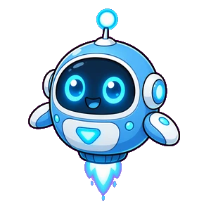

# 🎮 QuestVerse Game - Boss Hall System Refactor

จะส่งโค้ดครบทุกไฟล์ที่แก้/สร้างใหม่ตามลำดับ:

## 1. js/boss.js (Refactored Engine)

```javascript
// boss.js - Refactored Boss Battle Engine
// Supports multiple bosses with individual configs

const BOSS_CONFIGS = {
  mathos: {
    id: 'mathos',
    name: 'Mathos the Calculator',
    subject: 'math',
    difficulty: 2,
    requiredXP: 0,
    arenaBg: 'assets/arena_mathos.webp',
    bossImg: 'assets/boss_mathos.webp',
    introCutIn: 'ตัวเลขจะเป็นเจ้าของเจ้า!',
    victoryMsg: 'สมการพังทลาย... คุณชนะแล้ว',
    defeatMsg: 'ฮ่าฮ่า! ตัวเลขไม่โกหก แต่เจ้าผิดพลาด!',
    attackTheme: {
      fireball: { color: '#ff6b35', name: 'สมการเพลิง' },
      ice: { color: '#4ecdc4', name: 'พีระมิดน้ำแข็ง' },
      portal: { color: '#ffd93d', name: 'มิติคณิตศาสตร์' }
    },
    baseDifficulty: {
      attackInterval: 4000,
      firstAttackDelay: 6000,
      playerSpeed: 4.5
    }
  },
  chronos: {
    id: 'chronos',
    name: 'Chronos the Timekeeper',
    subject: 'science',
    difficulty: 3,
    requiredXP: 100,
    arenaBg: 'assets/arena_chronos.webp',
    bossImg: 'assets/boss_chronos.webp',
    introCutIn: 'เวลาไม่เคยรอใคร!',
    victoryMsg: 'นาฬิกาหยุดชะงัก... วิทยาศาสตร์ยอมรับเจ้า',
    defeatMsg: 'เวลาเดินต่อ แต่เจ้าหยุดที่นี่!',
    attackTheme: {
      fireball: { color: '#9d4edd', name: 'คลื่นเวลา' },
      ice: { color: '#00b4d8', name: 'ห้วงเวลาหยุดนิ่ง' },
      portal: { color: '#e0aaff', name: 'ประตูมิติกาลเวลา' }
    },
    baseDifficulty: {
      attackInterval: 3500,
      firstAttackDelay: 5500,
      playerSpeed: 4.8
    }
  },
  kawi: {
    id: 'kawi',
    name: 'Kawi the Scribe',
    subject: 'thai',
    difficulty: 3,
    requiredXP: 250,
    arenaBg: 'assets/arena_kawi.webp',
    bossImg: 'assets/boss_kawi.webp',
    introCutIn: 'กลอนนี้ มิต้องการให้คุณอ่าน...ให้คุณหลีก!',
    victoryMsg: 'อักษรสลาย... ภาษาไทยยอมรับคุณแล้ว',
    defeatMsg: 'วรรณคดีไม่อภัย! กลับไปท่องใหม่!',
    attackTheme: {
      fireball: { color: '#d4a574', name: 'อักษรเพลิง' },
      ice: { color: '#6a994e', name: 'กลอนน้ำแข็ง' },
      portal: { color: '#f4a261', name: 'ประตูวรรณคดี' }
    },
    baseDifficulty: {
      attackInterval: 3200,
      firstAttackDelay: 5000,
      playerSpeed: 5.0
    }
  },
  lex: {
    id: 'lex',
    name: 'Lex the Oracle',
    subject: 'english',
    difficulty: 4,
    requiredXP: 450,
    arenaBg: 'assets/arena_lex.webp',
    bossImg: 'assets/boss_lex.webp',
    introCutIn: 'The future is written in flames...',
    victoryMsg: 'The prophecy... was wrong. You prevailed.',
    defeatMsg: 'I foresaw this defeat. Better luck next timeline!',
    attackTheme: {
      fireball: { color: '#3b6dff', name: 'Mystic Blaze' },
      ice: { color: '#38bdf8', name: 'Frozen Words' },
      portal: { color: '#818cf8', name: 'Oracle Gateway' }
    },
    baseDifficulty: {
      attackInterval: 2800,
      firstAttackDelay: 4500,
      playerSpeed: 5.2
    }
  },
  terra: {
    id: 'terra',
    name: 'Sage Terra',
    subject: 'social',
    difficulty: 5,
    requiredXP: 700,
    arenaBg: 'assets/arena_terra.webp',
    bossImg: 'assets/boss_terra.webp',
    introCutIn: 'อารยธรรมทั้งหมด ย่อมพังทลาย...',
    victoryMsg: 'ประวัติศาสตร์เขียนใหม่... คุณคือตำนาน',
    defeatMsg: 'อารยธรรมล่มสลาย และคุณก็เช่นกัน!',
    attackTheme: {
      fireball: { color: '#e9a568', name: 'ลาวาอารยธรรม' },
      ice: { color: '#6ee7b7', name: 'ยุคน้ำแข็ง' },
      portal: { color: '#fbbf24', name: 'ประตูประวัติศาสตร์' }
    },
    baseDifficulty: {
      attackInterval: 2400,
      firstAttackDelay: 4000,
      playerSpeed: 5.5
    }
  }
};

const EVENT_CARDS = [
  {
    id: 'asteroid',
    name: 'พายุอุกกาบาต!',
    img: 'assets/event_asteroid.webp',
    duration: 4000,
    effect: 'asteroids'
  },
  {
    id: 'blackhole',
    name: 'หลุมดำ!',
    img: 'assets/event_blackhole.webp',
    duration: 6000,
    effect: 'blackhole'
  },
  {
    id: 'gift',
    name: 'บอสใจดี!',
    img: 'assets/event_gift.webp',
    duration: 2000,
    effect: 'heal'
  }
];

const BossBattle = {
  root: null,
  currentBoss: null,
  config: null,
  player: { x: 0, y: 0, hp: 3, maxHp: 3, speed: 4.5 },
  currentQuestion: null,
  questionIndex: 0,
  answerPads: [],
  attacks: [],
  keys: {},
  joystick: { active: false, deltaX: 0, deltaY: 0 },
  campingTimer: null,
  campingWarningShown: false,
  campingPosition: null,
  standingTimer: null,
  standingPad: null,
  animationFrame: null,
  attackInterval: null,
  correctAnswers: 0,
  totalQuestions: 0,
  comboCount: 0,
  comboDashActive: false,
  comboDashTimer: null,
  selectedItem: null,
  itemUsed: false,
  shieldActive: false,
  potionStacks: 0,
  boostActive: false,
  boostTimer: null,
  eventTimer: null,
  activeEvent: null,
  asteroids: [],
  petMito: { offsetX: -40, offsetY: -30, bobPhase: 0 },

  mount(rootElement, bossId, selectedItem = null) {
    this.root = rootElement;
    this.currentBoss = bossId;
    this.config = BOSS_CONFIGS[bossId];
    this.selectedItem = selectedItem;
    
    if (!this.config) {
      console.error('Invalid boss ID:', bossId);
      return;
    }

    this.reset();
    this.render();
    this.showIntroCutIn();
  },

  reset() {
    this.player = {
      x: 400,
      y: 300,
      hp: 3,
      maxHp: 3,
      speed: this.config.baseDifficulty.playerSpeed
    };
    this.currentQuestion = null;
    this.questionIndex = 0;
    this.answerPads = [];
    this.attacks = [];
    this.keys = {};
    this.joystick = { active: false, deltaX: 0, deltaY: 0 };
    this.campingTimer = null;
    this.campingWarningShown = false;
    this.campingPosition = null;
    this.standingTimer = null;
    this.standingPad = null;
    this.correctAnswers = 0;
    this.totalQuestions = 0;
    this.comboCount = 0;
    this.comboDashActive = false;
    this.itemUsed = false;
    this.shieldActive = false;
    this.potionStacks = 0;
    this.boostActive = false;
    this.activeEvent = null;
    this.asteroids = [];
    
    if (this.animationFrame) cancelAnimationFrame(this.animationFrame);
    if (this.attackInterval) clearInterval(this.attackInterval);
    if (this.comboDashTimer) clearTimeout(this.comboDashTimer);
    if (this.boostTimer) clearTimeout(this.boostTimer);
    if (this.eventTimer) clearTimeout(this.eventTimer);

    // Apply item
    if (this.selectedItem === 'shield') {
      this.shieldActive = true;
    } else if (this.selectedItem === 'boost') {
      this.activateBoost();
    }
  },

  activateBoost() {
    this.boostActive = true;
    this.boostTimer = setTimeout(() => {
      this.boostActive = false;
    }, 10000);
  },

  render() {
    const theme = this.config.attackTheme;
    this.root.innerHTML = `
      <div class="boss-battle" style="background-image: url('${this.config.arenaBg}');">
        <div class="intro-cutin" id="introCutin"></div>
        
        <div class="hud">
          <div class="hud-left">
            <div class="boss-info">
              
              <div class="boss-name">${this.config.name}</div>
            </div>
          </div>
          <div class="hud-center">
            <div class="score-display">
              <span class="combo-counter" id="comboCounter">Combo: 0</span>
              <span class="question-progress">${this.correctAnswers}/10</span>
            </div>
            ${this.comboDashActive ? '<div class="comet-dash-indicator">⚡ COMET DASH!</div>' : ''}
          </div>
          <div class="hud-right">
            <div class="hp-display">
              ${Array(this.player.maxHp).fill(0).map((_, i) => 
                `<span class="heart ${i < this.player.hp ? 'filled' : ''}">${i < this.player.hp ? '❤️' : '🖤'}</span>`
              ).join('')}
            </div>
            ${this.selectedItem ? `<div class="item-display">
              
            </div>` : ''}
            ${this.shieldActive && !this.itemUsed ? '<div class="shield-indicator">🛡️</div>' : ''}
            ${this.boostActive ? '<div class="boost-indicator">⚡</div>' : ''}
          </div>
        </div>

        <div class="arena" id="arena">
          <div class="player-sprite" id="player" style="left: ${this.player.x}px; top: ${this.player.y}px;">
            <div class="player-core"></div>
          </div>
          <div class="pet-mito" id="petMito">
            
          </div>
          <div class="answer-pads-container" id="answerPads"></div>
          <div class="attacks-container" id="attacks"></div>
          <div class="camping-warning" id="campingWarning">⚠️ หยุดแช่! มีลูกไฟกำลังจะมา!</div>
          <div class="event-card-display" id="eventCard"></div>
        </div>

        <div class="joystick-container" id="joystick">
          <div class="joystick-pad">
            <div class="joystick-stick" id="joystickStick"></div>
          </div>
        </div>

        <div class="victory-screen" id="victoryScreen"></div>
        <div class="defeat-screen" id="defeatScreen"></div>
      </div>
    `;

    this.setupControls();
  },

  showIntroCutIn() {
    const cutinEl = document.getElementById('introCutin');
    cutinEl.innerHTML = `
      <div class="cutin-content">
        
        <h1 class="cutin-boss-name">${this.config.name}</h1>
        <p class="cutin-quote">${this.config.introCutIn}</p>
      </div>
    `;
    cutinEl.classList.add('show');

    setTimeout(() => {
      cutinEl.classList.remove('show');
      setTimeout(() => {
        this.startBattle();
      }, 500);
    }, 3000);
  },

  startBattle() {
    this.loadQuestion();
    this.startAttackCycle();
    this.animationFrame = requestAnimationFrame(() => this.gameLoop());
  },

  loadQuestion() {
    const questionsData = window.questions[this.config.subject];
    if (!questionsData || !questionsData.questions) {
      console.error('Questions not found for subject:', this.config.subject);
      return;
    }

    const availableQuestions = questionsData.questions.filter((_, idx) => 
      !this.usedQuestions || !this.usedQuestions.has(idx)
    );

    if (availableQuestions.length === 0) {
      this.usedQuestions = new Set();
      this.currentQuestion = questionsData.questions[Math.floor(Math.random() * questionsData.questions.length)];
    } else {
      this.currentQuestion = availableQuestions[Math.floor(Math.random() * availableQuestions.length)];
      if (!this.usedQuestions) this.usedQuestions = new Set();
      this.usedQuestions.add(questionsData.questions.indexOf(this.currentQuestion));
    }

    this.generateAnswerPads();
    this.totalQuestions++;

    // Event card every 3 questions
    if (this.totalQuestions % 3 === 0 && this.totalQuestions > 0) {
      this.triggerEventCard();
    }
  },

  generateAnswerPads() {
    const PAD_RADIUS = 60;
    const PAD_MIN_DISTANCE = 180;
    const ARENA_PADDING = 100;
    const arenaWidth = 800;
    const arenaHeight = 600;

    const positions = [];
    const choices = [...this.currentQuestion.choices];
    
    // Shuffle choices
    for (let i = choices.length - 1; i > 0; i--) {
      const j = Math.floor(Math.random() * (i + 1));
      [choices[i], choices[j]] = [choices[j], choices[i]];
    }

    // Place 8 pads
    for (let i = 0; i < 8; i++) {
      let attempts = 0;
      let pos;
      
      do {
        pos = {
          x: ARENA_PADDING + Math.random() * (arenaWidth - 2 * ARENA_PADDING),
          y: ARENA_PADDING + Math.random() * (arenaHeight - 2 * ARENA_PADDING)
        };
        attempts++;
      } while (
        attempts < 100 &&
        positions.some(p => Math.hypot(p.x - pos.x, p.y - pos.y) < PAD_MIN_DISTANCE)
      );

      const choiceIndex = i % choices.length;
      positions.push({
        ...pos,
        text: choices[choiceIndex],
        isCorrect: choices[choiceIndex] === this.currentQuestion.choices[this.currentQuestion.answerIdx]
      });
    }

    this.answerPads = positions;
    this.renderAnswerPads();
  },

  renderAnswerPads() {
    const container = document.getElementById('answerPads');
    container.innerHTML = this.answerPads.map((pad, idx) => `
      <div class="answer-pad ${this.comboDashActive && pad.isCorrect ? 'combo-glow' : ''}" 
           data-index="${idx}"
           style="left: ${pad.x}px; top: ${pad.y}px;">
        <div class="pad-text">${pad.text}</div>
        <div class="pad-core"></div>
      </div>
    `).join('');
  },

  setupControls() {
    // Keyboard
    document.addEventListener('keydown', (e) => {
      this.keys[e.key.toLowerCase()] = true;
    });
    document.addEventListener('keyup', (e) => {
      this.keys[e.key.toLowerCase()] = false;
    });

    // Joystick
    const joystickPad = document.querySelector('.joystick-pad');
    const joystickStick = document.getElementById('joystickStick');
    
    const handleJoystickStart = (e) => {
      e.preventDefault();
      this.joystick.active = true;
    };

    const handleJoystickMove = (e) => {
      if (!this.joystick.active) return;
      e.preventDefault();

      const touch = e.touches ? e.touches[0] : e;
      const rect = joystickPad.getBoundingClientRect();
      const centerX = rect.left + rect.width / 2;
      const centerY = rect.top + rect.height / 2;
      
      let deltaX = touch.clientX - centerX;
      let deltaY = touch.clientY - centerY;
      const distance = Math.sqrt(deltaX * deltaX + deltaY * deltaY);
      const maxDistance = 40;

      if (distance > maxDistance) {
        deltaX = (deltaX / distance) * maxDistance;
        deltaY = (deltaY / distance) * maxDistance;
      }

      this.joystick.deltaX = deltaX / maxDistance;
      this.joystick.deltaY = deltaY / maxDistance;

      joystickStick.style.transform = `translate(${deltaX}px, ${deltaY}px)`;
    };

    const handleJoystickEnd = (e) => {
      e.preventDefault();
      this.joystick.active = false;
      this.joystick.deltaX = 0;
      this.joystick.deltaY = 0;
      joystickStick.style.transform = 'translate(0, 0)';
    };

    joystickPad.addEventListener('touchstart', handleJoystickStart);
    joystickPad.addEventListener('touchmove', handleJoystickMove);
    joystickPad.addEventListener('touchend', handleJoystickEnd);
    joystickPad.addEventListener('mousedown', handleJoystickStart);
    document.addEventListener('mousemove', handleJoystickMove);
    document.addEventListener('mouseup', handleJoystickEnd);
  },

  gameLoop() {
    this.updatePlayer();
    this.updateAttacks();
    this.checkCollisions();
    this.checkCamping();
    this.checkStanding();
    this.updatePetPosition();
    
    if (this.activeEvent) {
      if (this.activeEvent.effect === 'asteroids') {
        this.updateAsteroids();
      } else if (this.activeEvent.effect === 'blackhole') {
        this.updateBlackhole();
      }
    }

    this.animationFrame = requestAnimationFrame(() => this.gameLoop());
  },

  updatePlayer() {
    let vx = 0;
    let vy = 0;

    // Keyboard
    if (this.keys['w'] || this.keys['arrowup']) vy -= 1;
    if (this.keys['s'] || this.keys['arrowdown']) vy += 1;
    if (this.keys['a'] || this.keys['arrowleft']) vx -= 1;
    if (this.keys['d'] || this.keys['arrowright']) vx += 1;

    // Joystick
    if (this.joystick.active) {
      vx += this.joystick.deltaX;
      vy += this.joystick.deltaY;
    }

    if (vx !== 0 || vy !== 0) {
      const magnitude = Math.sqrt(vx * vx + vy * vy);
      vx /= magnitude;
      vy /= magnitude;

      let speed = this.player.speed;
      if (this.comboDashActive) speed *= 1.3;

      this.player.x += vx * speed;
      this.player.y += vy * speed;

      // Bounds
      this.player.x = Math.max(20, Math.min(780, this.player.x));
      this.player.y = Math.max(20, Math.min(580, this.player.y));
    }

    const playerEl = document.getElementById('player');
    if (playerEl) {
      playerEl.style.left = this.player.x + 'px';
      playerEl.style.top = this.player.y + 'px';
    }
  },

  updatePetPosition() {
    const petEl = document.getElementById('petMito');
    if (!petEl) return;

    this.petMito.bobPhase += 0.05;
    const bobOffset = Math.sin(this.petMito.bobPhase) * 5;

    petEl.style.left = (this.player.x + this.petMito.offsetX) + 'px';
    petEl.style.top = (this.player.y + this.petMito.offsetY + bobOffset) + 'px';
  },

  checkCamping() {
    const CAMPING_THRESHOLD = 30;
    const CAMPING_TIME = 4500;

    if (!this.campingPosition) {
      this.campingPosition = { x: this.player.x, y: this.player.y };
      this.campingTimer = Date.now();
      return;
    }

    const distance = Math.hypot(
      this.player.x - this.campingPosition.x,
      this.player.y - this.campingPosition.y
    );

    if (distance > CAMPING_THRESHOLD) {
      this.campingPosition = { x: this.player.x, y: this.player.y };
      this.campingTimer = Date.now();
      this.campingWarningShown = false;
      document.getElementById('campingWarning').classList.remove('show', 'pulse');
    } else {
      const elapsed = Date.now() - this.campingTimer;
      
      if (elapsed > CAMPING_TIME && !this.campingWarningShown) {
        this.campingWarningShown = true;
        const warning = document.getElementById('campingWarning');
        warning.classList.add('show', 'pulse');
        
        setTimeout(() => {
          this.spawnTargetedFireball();
          warning.classList.remove('show', 'pulse');
          this.campingPosition = { x: this.player.x, y: this.player.y };
          this.campingTimer = Date.now();
          this.campingWarningShown = false;
        }, 2000);
      }
    }
  },

  spawnTargetedFireball() {
    const angle = Math.random() * Math.PI * 2;
    const distance = 400;
    const startX = this.player.x + Math.cos(angle) * distance;
    const startY = this.player.y + Math.sin(angle) * distance;

    this.attacks.push({
      type: 'fireball',
      x: startX,
      y: startY,
      targetX: this.player.x,
      targetY: this.player.y,
      speed: 3,
      radius: 25,
      color: this.config.attackTheme.fireball.color
    });
    this.renderAttacks();
  },

  checkStanding() {
    const STAND_THRESHOLD = 40;
    const STAND_TIME = 800;

    let currentPad = null;
    for (let i = 0; i < this.answerPads.length; i++) {
      const pad = this.answerPads[i];
      const distance = Math.hypot(this.player.x - pad.x, this.player.y - pad.y);
      if (distance < STAND_THRESHOLD) {
        currentPad = i;
        break;
      }
    }

    if (currentPad !== null) {
      if (this.standingPad === currentPad) {
        const elapsed = Date.now() - this.standingTimer;
        if (elapsed > STAND_TIME) {
          this.submitAnswer(currentPad);
          this.standingPad = null;
          this.standingTimer = null;
        }
      } else {
        this.standingPad = currentPad;
        this.standingTimer = Date.now();
      }
    } else {
      this.standingPad = null;
      this.standingTimer = null;
    }
  },

  submitAnswer(padIndex) {
    const pad = this.answerPads[padIndex];
    if (!pad) return;

    if (pad.isCorrect) {
      this.correctAnswers++;
      this.comboCount++;
      
      // Potion item
      if (this.selectedItem === 'potion' && !this.itemUsed) {
        this.potionStacks++;
        if (this.potionStacks >= 3) {
          if (this.player.hp < this.player.maxHp) {
            this.player.hp++;
            this.updateHUD();
          }
          this.potionStacks = 0;
        }
      }

      // Combo dash
      if (this.comboCount >= 3 && !this.comboDashActive) {
        this.activateCometDash();
      }

      // 10 correct answers bonus
      if (this.correctAnswers >= 10) {
        this.showVictory();
        return;
      }

      this.loadQuestion();
    } else {
      this.takeDamage();
      this.comboCount = 0;
    }

    this.updateHUD();
  },

  activateCometDash() {
    this.comboDashActive = true;
    this.renderAnswerPads();
    
    this.comboDashTimer = setTimeout(() => {
      this.comboDashActive = false;
      this.renderAnswerPads();
    }, 5000);

    this.updateHUD();
  },

  takeDamage() {
    if (this.shieldActive && !this.itemUsed) {
      this.shieldActive = false;
      this.itemUsed = true;
      return;
    }

    this.player.hp--;
    if (this.player.hp <= 0) {
      this.showDefeat();
    }
  },

  startAttackCycle() {
    const baseInterval = this.config.baseDifficulty.attackInterval;
    const interval = this.boostActive ? baseInterval * 1.4 : baseInterval;

    setTimeout(() => {
      this.spawnAttack();
      this.attackInterval = setInterval(() => {
        this.spawnAttack();
      }, interval);
    }, this.config.baseDifficulty.firstAttackDelay);
  },

  spawnAttack() {
    const attackTypes = ['fireball', 'ice', 'portal'];
    const type = attackTypes[Math.floor(Math.random() * attackTypes.length)];

    if (type === 'fireball') {
      const angle = Math.random() * Math.PI * 2;
      const distance = 450;
      const startX = 400 + Math.cos(angle) * distance;
      const startY = 300 + Math.sin(angle) * distance;
      const targetX = 400 + (Math.random() - 0.5) * 400;
      const targetY = 300 + (Math.random() - 0.5) * 300;

      this.attacks.push({
        type: 'fireball',
        x: startX,
        y: startY,
        targetX,
        targetY,
        speed: 2.5,
        radius: 25,
        color: this.config.attackTheme.fireball.color
      });
    } else if (type === 'ice') {
      const x = Math.random() * 700 + 50;
      const y = Math.random() * 500 + 50;

      this.attacks.push({
        type: 'ice',
        x,
        y,
        radius: 50,
        lifetime: 3000,
        createdAt: Date.now(),
        color: this.config.attackTheme.ice.color
      });
    } else if (type === 'portal') {
      const x1 = Math.random() * 700 + 50;
      const y1 = Math.random() * 500 + 50;
      const x2 = Math.random() * 700 + 50;
      const y2 = Math.random() * 500 + 50;

      this.attacks.push({
        type: 'portal',
        portals: [
          { x: x1, y: y1, radius: 40 },
          { x: x2, y: y2, radius: 40 }
        ],
        lifetime: 4000,
        createdAt: Date.now(),
        color: this.config.attackTheme.portal.color
      });
    }

    this.renderAttacks();
  },

  updateAttacks() {
    const now = Date.now();
    
    this.attacks = this.attacks.filter(attack => {
      if (attack.type === 'fireball') {
        const dx = attack.targetX - attack.x;
        const dy = attack.targetY - attack.y;
        const distance = Math.sqrt(dx * dx + dy * dy);
        
        if (distance < attack.speed) return false;
        
        attack.x += (dx / distance) * attack.speed;
        attack.y += (dy / distance) * attack.speed;
        return true;
      } else if (attack.type === 'ice' || attack.type === 'portal') {
        return (now - attack.createdAt) < attack.lifetime;
      }
      return true;
    });

    this.renderAttacks();
  },

  renderAttacks() {
    const container = document.getElementById('attacks');
    container.innerHTML = this.attacks.map((attack, idx) => {
      if (attack.type === 'fireball') {
        return `<div class="attack fireball" style="left: ${attack.x}px; top: ${attack.y}px; background: ${attack.color};"></div>`;
      } else if (attack.type === 'ice') {
        return `<div class="attack ice" style="left: ${attack.x}px; top: ${attack.y}px; background: ${attack.color};"></div>`;
      } else if (attack.type === 'portal') {
        return attack.portals.map((p, i) => 
          `<div class="attack portal" style="left: ${p.x}px; top: ${p.y}px; background: ${attack.color};"></div>`
        ).join('');
      }
      return '';
    }).join('');
  },

  checkCollisions() {
    for (const attack of this.attacks) {
      if (attack.type === 'fireball') {
        const distance = Math.hypot(this.player.x - attack.x, this.player.y - attack.y);
        if (distance < attack.radius + 15) {
          this.takeDamage();
          this.attacks = this.attacks.filter(a => a !== attack);
          this.renderAttacks();
          return;
        }
      } else if (attack.type === 'ice') {
        const distance = Math.hypot(this.player.x - attack.x, this.player.y - attack.y);
        if (distance < attack.radius + 15) {
          this.takeDamage();
          this.attacks = this.attacks.filter(a => a !== attack);
          this.renderAttacks();
          return;
        }
      } else if (attack.type === 'portal') {
        for (const portal of attack.portals) {
          const distance = Math.hypot(this.player.x - portal.x, this.player.y - portal.y);
          if (distance < portal.radius + 15) {
            this.takeDamage();
            this.attacks = this.attacks.filter(a => a !== attack);
            this.renderAttacks();
            return;
          }
        }
      }
    }
  },

  triggerEventCard() {
    const event = EVENT_CARDS[Math.floor(Math.random() * EVENT_CARDS.length)];
    this.showEventCard(event);
  },

  showEventCard(event) {
    const cardEl = document.getElementById('eventCard');
    cardEl.innerHTML = `
      <div class="event-card">
        
        <h2>${event.name}</h2>
      </div>
    `;
    cardEl.classList.add('show');

    setTimeout(() => {
      cardEl.classList.remove('show');
      this.activeEvent = event;
      
      if (event.effect === 'asteroids') {
        this.spawnAsteroids();
      } else if (event.effect === 'heal') {
        if (this.player.hp < this.player.maxHp) {
          this.player.hp++;
          this.updateHUD();
        }
        this.activeEvent = null;
      }

      if (event.effect !== 'heal') {
        this.eventTimer = setTimeout(() => {
          this.activeEvent = null;
          this.asteroids = [];
          this.renderAttacks();
        }, event.duration);
      }
    }, 2000);
  },

  spawnAsteroids() {
    for (let i = 0; i < 5; i++) {
      const angle = Math.random() * Math.PI * 2;
      const startX = 400 + Math.cos(angle) * 500;
      const startY = 300 + Math.sin(angle) * 500;
      const targetX = 400 + (Math.random() - 0.5) * 600;
      const targetY = 300 + (Math.random() - 0.5) * 400;

      this.asteroids.push({
        x: startX,
        y: startY,
        targetX,
        targetY,
        speed: 4,
        radius: 30
      });
    }
  },

  updateAsteroids() {
    this.asteroids = this.asteroids.filter(asteroid => {
      const dx = asteroid.targetX - asteroid.x;
      const dy = asteroid.targetY - asteroid.y;
      const distance = Math.sqrt(dx * dx + dy * dy);
      
      if (distance < asteroid.speed) return false;
      
      asteroid.x += (dx / distance) * asteroid.speed;
      asteroid.y += (dy / distance) * asteroid.speed;

      // Check collision
      const playerDist = Math.hypot(this.player.x - asteroid.x, this.player.y - asteroid.y);
      if (playerDist < asteroid.radius + 15) {
        this.takeDamage();
        return false;
      }

      return true;
    });

    const container = document.getElementById('attacks');
    const asteroidHTML = this.asteroids.map(a => 
      `<div class="attack asteroid" style="left: ${a.x}px; top: ${a.y}px;"></div>`
    ).join('');
    container.innerHTML += asteroidHTML;
  },

  updateBlackhole() {
    // Pull pads together
    const centerX = 400;
    const centerY = 300;
    const pullStrength = 0.5;

    this.answerPads.forEach(pad => {
      const dx = centerX - pad.x;
      const dy = centerY - pad.y;
      pad.x += dx * pullStrength * 0.01;
      pad.y += dy * pullStrength * 0.01;
    });

    this.renderAnswerPads();
  },

  updateHUD() {
    const hpDisplay = document.querySelector('.hud-right .hp-display');
    hpDisplay.innerHTML = Array(this.player.maxHp).fill(0).map((_, i) => 
      `<span class="heart ${i < this.player.hp ? 'filled' : ''}">${i < this.player.hp ? '❤️' : '🖤'}</span>`
    ).join('');

    const progress = document.querySelector('.question-progress');
    progress.textContent = `${this.correctAnswers}/10`;

    const comboCounter = document.getElementById('comboCounter');
    comboCounter.textContent = `Combo: ${this.comboCount}`;

    const hudCenter = document.querySelector('.hud-center');
    const existingDash = hudCenter.querySelector('.comet-dash-indicator');
    if (this.comboDashActive && !existingDash) {
      hudCenter.innerHTML += '<div class="comet-dash-indicator">⚡ COMET DASH!</div>';
    } else if (!this.comboDashActive && existingDash) {
      existingDash.remove();
    }
  },

  showVictory() {
    if (this.animationFrame) cancelAnimationFrame(this.animationFrame);
    if (this.attackInterval) clearInterval(this.attackInterval);